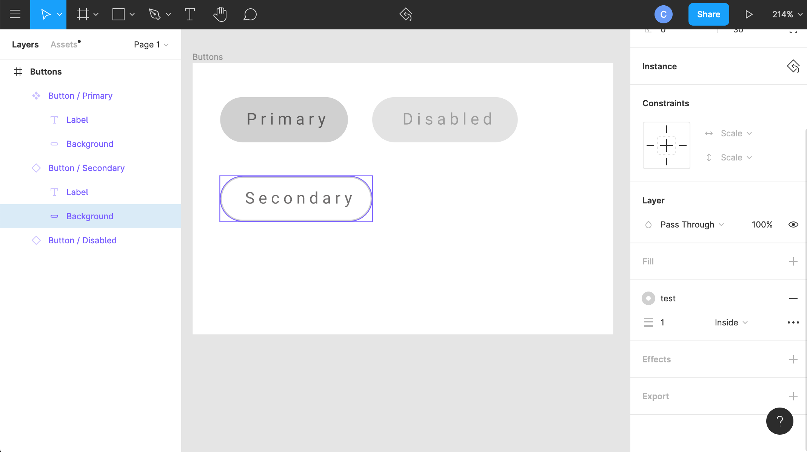
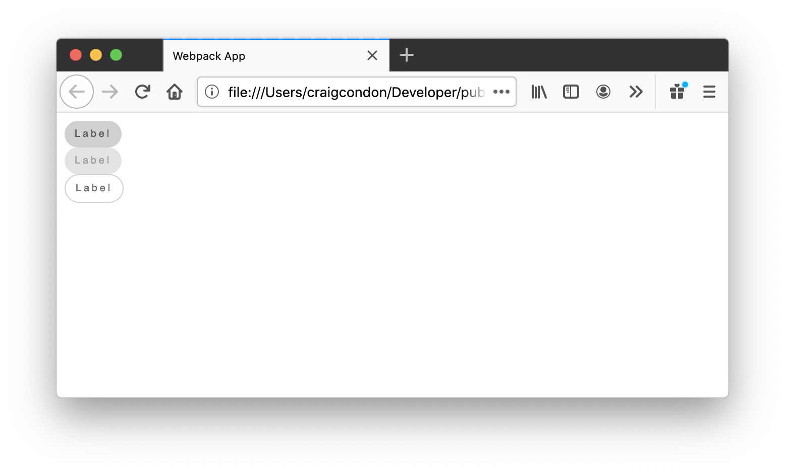
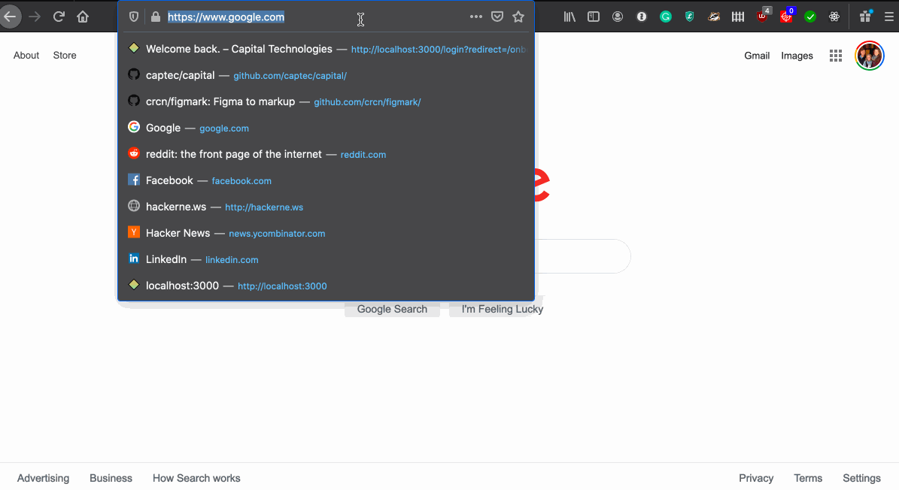
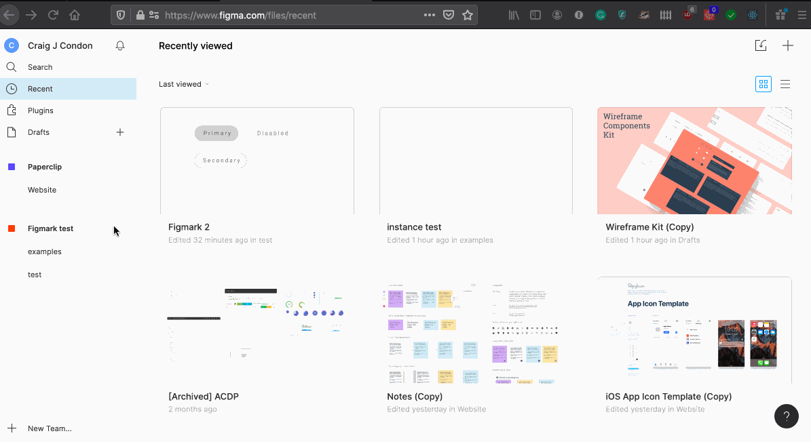

Figmark is a fully transparent tool that allows you to use Figma designs in your web application in a responsive way.

### Resources

- [Getting Started](#getting-started)
- [Examples](./examples)

### How does it work?

Here are a few button variations in Figma:



Using [Figmark's CLI tool](#cli-usage), designs are automatically downloaded & translated into code that looks something like this:

```html
<!-- STYLES -->

<style>
  :global(._5710_buttonPrimary) {
    & :global(._579_ButtonPrimary_Background) {
      background: #d0d0d0;
      border-radius: 30px;
    }
    & :global(._5711_ButtonPrimary_Label) {
      mix-blend-mode: multiply;
      display: flex;
      align-items: center;
      font-family: Roboto;
      font-weight: 400;
      font-size: 10px;
      letter-spacing: 0.24em;
      text-align: center;
      font-featutes-settings: "onum" on, "tnum" on;
      color: #716f6f;
    }
  }

  :global(._578_buttons) {
    background: #ffffff;
    overflow: hidden;
  }
  :global(._5720_buttonDisabled) {
    opacity: 0.6000000238418579;
  }

  :global(._5723_buttonSecondary) {
    & :global(._579_ButtonPrimary_Background) {
      background: unset;
      border: 1px solid #d0d0d0;
    }
  }
</style>

<!-- ALL LAYERS & COMPONENTS -->

<div
  export
  component
  as="Buttons"
  data-with-absolute-layout="{withAbsoluteLayout?}"
  className="_578_buttons {className?}"
>
  {children}
</div>

<div
  export
  component
  as="ButtonPrimary"
  data-with-absolute-layout="{withAbsoluteLayout?}"
  className="_5710_buttonPrimary {className?}"
>
  {children}
</div>

<div
  export
  component
  as="ButtonPrimary_Background"
  data-with-absolute-layout="{withAbsoluteLayout?}"
  className="_579_ButtonPrimary_Background {className?}"
>
  {children}
</div>

<span
  export
  component
  as="ButtonPrimary_Label"
  data-with-absolute-layout="{withAbsoluteLayout?}"
  className="_5711_ButtonPrimary_Label {className?}"
>
  {children}
</span>
```

From here, we can use [Paperclip](https://github.com/crcn/paperclip) to load these templates into our application code. Here's an example of how we can do that in React:

```jsx
import * as React from "react";
import * as ReactDOM from "react-dom";
import * as cx from "classnames";
import {
  ButtonPrimary,
  ButtonPrimary_Label3,
  ButtonPrimary_Background3,
  classNames,
} from "./design-generated/test/figmark-2.pc";
import styled from "styled-components";

const StyledButton = styled(ButtonPrimary)`
  cursor: pointer;
  display: block;
  display: flex;
  .${classNames.buttonPrimary_background3} {
    padding: 8px 10px;
  }
  .${classNames.buttonPrimary_label3} {
    font-family: Helvetica;
  }
`;

type EnhancedButtonProps = {
  disabled?: boolean,
  primary?: boolean,
  secondary?: boolean,
  children?: React.ReactNode,
};

const EnhancedButton = ({
  disabled,
  secondary,
  children,
}: EnhancedButtonProps) => (
  <StyledButton
    className={cx({
      [classNames.buttonDisabled]: disabled,
      [classNames.buttonSecondary]: secondary,
    })}
  >
    <ButtonPrimary_Background3>
      <ButtonPrimary_Label3>{children}</ButtonPrimary_Label3>
    </ButtonPrimary_Background3>
  </StyledButton>
);

const App = () => {
  return (
    <>
      <EnhancedButton>Primary</EnhancedButton>
      <EnhancedButton secondary>Secondary</EnhancedButton>
      <EnhancedButton disabled>Disabled</EnhancedButton>
      <EnhancedButton disabled secondary>
        Disabled Secondary
      </EnhancedButton>
    </>
  );
};
```

Here's what the code above looks like when loaded in a browser.



That's all there is to it! 🎉

## Getting started

To get started, you'll need to install the CLI tool - go ahead and run:

```
npm install figmark -g
```

After that, `cd` to your project directory, then run:

```
figmark init
```

This will prompt you for a few necessary things, starting with your **Figma personal access key**. You'll need to generate a new one -- here's how you do that:



You'll _then_ be asked to set your **team ID**. You'll find it in the URL when you select a Figma team. Here's what I mean:



You'll need to answer a few more questions, then you should be good to go!

Next up, go ahead and download your design files:

```
figmark pull
```

That's it! Now you can start using your designs in code. Check out the [examples](./examples) on how to do that.
